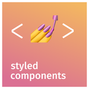

# Developer Portfolio

## Table of Contents
1. [Description](#description)
2. [Preview](#preview)
3. [Link](#link)
4. [Technologies](#technologies)
5. [Author](#author)
6. [Questions](#questions)

## Description
My personal portfolio website

## Preview

## Link
https://rickrocero.com/

## Technologies

## Author
| Name | GitHub  | LinkedIn |
| :--: | :-----: | :------: |
| Rick Rocero |  |  |

## Questions
For questions, contact [Rick](https://github.com/rickrocero) or email me at rickrocero@gmail.com.

